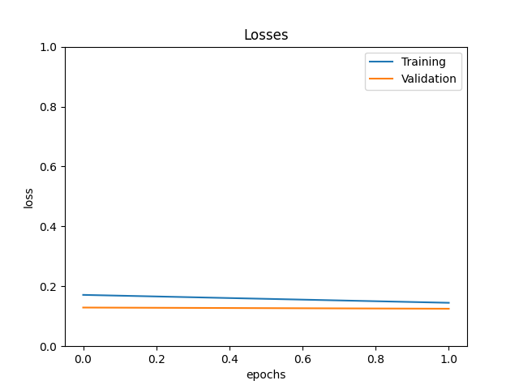

# model summary on 3rd March, 2023 - Friday

```
[arjuna@kurukshetra NVIDIA_Self-driving-car_simulation]$ python learningFromSimulation.py 
Setting up.... ...
Total images(center) loaded: 16357
Images listed for removal:  11891
Final images (after removal):  4466
Training set size:  3572
Test set size:  894
Model: "sequential"
_________________________________________________________________
 Layer (type)                Output Shape              Param #   
=================================================================
 conv2d (Conv2D)             (None, 31, 98, 24)        1824      
                                                                 
 conv2d_1 (Conv2D)           (None, 14, 47, 36)        21636     
                                                                 
 conv2d_2 (Conv2D)           (None, 5, 22, 48)         43248     
                                                                 
 conv2d_3 (Conv2D)           (None, 3, 20, 64)         27712     
                                                                 
 conv2d_4 (Conv2D)           (None, 1, 18, 64)         36928     
                                                                 
 flatten (Flatten)           (None, 1152)              0         
                                                                 
 dense (Dense)               (None, 100)               115300    
                                                                 
 dense_1 (Dense)             (None, 50)                5050      
                                                                 
 dense_2 (Dense)             (None, 10)                510       
                                                                 
 dense_3 (Dense)             (None, 1)                 11        
                                                                 
=================================================================
Total params: 252,219
Trainable params: 252,219
Non-trainable params: 0
_________________________________________________________________
```
## Training
with `steps_per_epoch`=#batches=20 and 2 epochs
results:
```
Epoch 1/2
20/20 [==============================] - 12s 521ms/step - loss: 0.1813 - val_loss: 0.1843
Epoch 2/2
20/20 [==============================] - 9s 458ms/step - loss: 0.1359 - val_loss: 0.1573
```
- after some time -- same configuration
```
Epoch 1/2
20/20 [==============================] - 8s 380ms/step - loss: 0.1714 - val_loss: 0.1291
Epoch 2/2
20/20 [==============================] - 6s 325ms/step - loss: 0.1449 - val_loss: 0.1251
Model saved successfully
```
and its loss plot..
