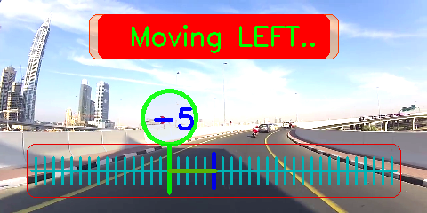
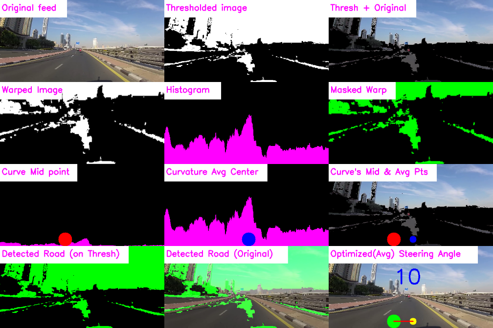

# Rebuild-Self_Driving_car
Up-gradation to the work done earlier at college time and lock-down time..

# Lane Detection
## References taken
1. [Murtaza Hassan - Self Driving Car with Lane Detection using Raspberry (2020)](https://www.youtube.com/playlist?list=PLMoSUbG1Q_r_wT0Ac7rOlhlwq9VsZDA0b)

## Usage
0. Install the dependency - `opencv` via 
    ```
    pip install opencv-python
   ```
1. Load a road video into the project's path
2. Modify the video name in
    ```
    capture = cv2.VideoCapture("video_name_here")
    ```
   in `start_detecting_lanes()` function present in `Lane_Detection.py`.
### Normal run
- Run the `Lane_Detection.py` as ```python Lane_Detection.py```.
### Tuning the parameters.
- Switch `debug_mode=False` from `debug_mode=True` in `__main__` in `Lane_Detection.py`
  - This enables trackbars which can be tuned as per the requirement and window showing 9 screens of various intermediate phases.
- then run.

## Improvements made..
### UI
- The final UI has improved over the original _(as in [1]-References)_. 
  - Added the navigation direction displayer on the top-center.
  - Designed a scale with a magnifier showing the `curve_measure` and moving on the scale as it updates in each frame.
  - It looks like.. 

## Additions made ..
- A UI has made which displays the intermediate processing, right from the original to the final -- in 9 phases.
  - This is by default hidden and can be activated by `debug_mode=True` in `Lane_Detection.py` at the driver (`__main__`)
  - Each phase is labelled at the top-left for clear indication of phase.
  - It looks like .. 

